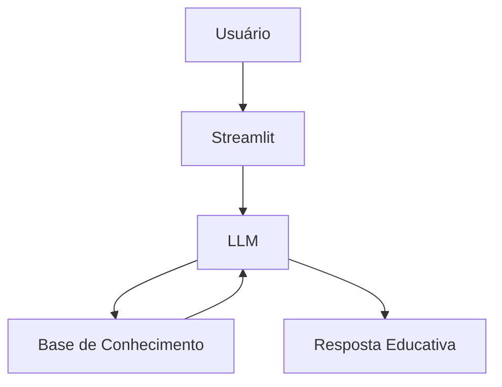

# 🎓 DevEnglish - Tutor Inteligente de Inglês para Devs

> Agente de IA Generativa que ensina inglês técnico para desenvolvedores de forma prática e personalizada, usando contexto real do dia a dia de programação.

---

## 💡 O Que é o DevEnglish?

O DevEnglish é um tutor de inglês que **ensina**, não apenas corrige. Ele ajuda desenvolvedores a aprender inglês técnico com explicações claras, exemplos reais e adaptação ao nível do usuário.

**O que o DevEnglish faz:**
- ✅ Corrige frases em inglês com explicação
- ✅ Ensina vocabulário técnico
- ✅ Ajuda em situações reais (PRs, entrevistas, documentação)
- ✅ Adapta o conteúdo ao nível do usuário

**O que o DevEnglish NÃO faz:**
- ❌ Não traduz sem explicar
- ❌ Não inventa regras gramaticais
- ❌ Não substitui um professor humano

---

## 🏗️ Arquitetura



**Stack:**
- Interface: Streamlit
- LLM: Ollama (modelo local `gpt-oss`)
- Dados: JSON/CSV mockados

## 📁 Estrutura do Projeto

```
├── data/                          # Base de conhecimento
│   ├── perfil_investidor.json     # Perfil do cliente
│   ├── transacoes.csv             # Histórico financeiro
│   ├── historico_atendimento.csv  # Interações anteriores
│   └── produtos_financeiros.json  # Produtos para ensino
│
├── docs/                          # Documentação completa
│   ├── 01-documentacao-agente.md  # Caso de uso e persona
│   ├── 02-base-conhecimento.md    # Estratégia de dados
│   ├── 03-prompts.md              # System prompt e exemplos
│   ├── 04-metricas.md             # Avaliação de qualidade
│   └── 05-pitch.md                # Apresentação do projeto
│
└── src/
    └── app.py                     # Aplicação Streamlit
```

## 🚀 Como Executar

### 1. Instalar Ollama

```bash
# Baixar em: ollama.com
ollama pull gpt-oss
ollama serve
```

### 2. Instalar Dependências

```bash
pip install streamlit pandas requests
```

### 3. Rodar o Edu

```bash
streamlit run src/app.py
```

## 🎯 Exemplo de Uso

**Pergunta:** "I did a commit yesterday and fix a bug"  
**DevEnglish:** "Correção: I made a commit yesterday and fixed a bug.
→ 'Did' não é usado com 'commit', o correto é 'make a commit'.
→ 'Fix' deve estar no passado: 'fixed'.
Quer ver mais exemplos com 'commit'?"

## 📊 Métricas de Avaliação

| Métrica | Objetivo |
|---------|----------|
| **Assertividade** | O agente responde o que foi perguntado? |
| **Segurança** | Evita inventar informações (anti-alucinação)? |
| **Coerência** | A resposta é adequada ao perfil do cliente? |

## 🎬 Diferenciais

- **Personalização:** Usa os dados do próprio cliente nos exemplos
- **100% Local:** Roda com Ollama, sem enviar dados para APIs externas
- **Educativo:** Foco em ensinar ativamente, não em apenas traduzir
- **Seguro:** Estratégias de anti-alucinação documentadas

## 📝 Documentação Completa

Toda a documentação técnica, estratégias de prompt e casos de teste estão disponíveis na pasta [`docs/`](./docs/).
